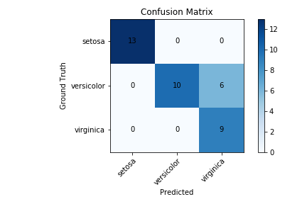
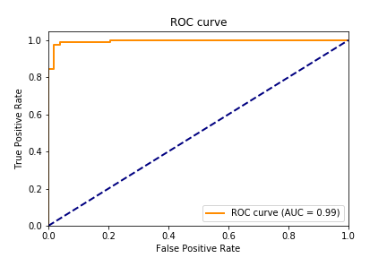

# classificationplots.py

`classificationplots.py` contains two functions that are useful for graphically analyzing
a classification of data. Each of these functions has their parameters described in their respective docstrings and has links to documentation for functions used from libraries.

## function `plot_confusion_matrix`

This function plots the confusion matrix for the classifier when provided ground truth labels and predicted labels. Be advised that the `labels` parameter has no default, and is not an optional argument. 

_EDIT_: It recently came to my attention that `sklearn.metrics` has a nice pre-built function that implements this way better called `plot_confusion_matrix`. This function takes the instance of a classifier as a non-optional argument, so if you are using this you must be using a classiifier from the Sci-kit learn library. 

Alternatively, you could define a class for your classifier, but you may need to make it an instance of some classifier base class and make sure it has the correct methods and attributes. This could be messy. Regardless, here is the [link](https://scikit-learn.org/stable/modules/generated/sklearn.metrics.plot_confusion_matrix.html#sklearn.metrics.plot_confusion_matrix) to the documentation:

### Parameters
---
- `y_true` : array-like of shape (n_samples,)
        Ground truth (correct) target values

- `y_pred` : array-like of shape (n_samples,)
    Estimated targets as returned by classifier

- `labels`: array-like of shape (n_classes)
    List of labels to index the matrix. This may be used to reorder
    or select a subset of labels. 
    If None is given, those that appear at least once 
    in y_true or y_pred are used in sorted order. Also used
    to label the confusion matrix x and y tick labels

- `normalize`: {'true', 'pred', 'all'}, default=None
    Normalizes confusion matrix over the true (rows),
    predicted(columns) or all the population. If None,
    confusion matrix will not be normalized

- `savefig`: boolean
    Save the figure as an image with extension specified
    in filename

### Returns
--- 
Displays a plot

See the following documentation:

- Making Heatmaps
    * https://matplotlib.org/3.1.1/gallery/images_contours_and_fields/image_annotated_heatmap.html
- sklearn.metrics.confusion_matrix
    * https://scikit-learn.org/stable/modules/generated/sklearn.metrics.confusion_matrix.html


### Example Usage
---

```python
import numpy as np
import matplotlib.pyplot as plt
from sklearn import svm, datasets
from sklearn.model_selection import train_test_split
from classificationplots import *

# import some data to play with
iris = datasets.load_iris()
X = iris.data
y = iris.target
class_names = iris.target_names

# Split the data into a training set and a test set
X_train, X_test, y_train, y_test = train_test_split(X, y, random_state=0)

# Run classifier
classifier = svm.SVC(kernel='linear', C=0.01).fit(X_train, y_train)

# Predict classes using test set
y_pred = classifier.predict(X_test)

# Map the integer codes for classes to actual class names
map_dict = {0:class_names[0], 1:class_names[1], 2:class_names[2]}
y_test = np.array(list(map(map_dict.get, y_test)))
y_pred = np.array(list(map(map_dict.get, y_pred)))

plot_confusion_matrix(y_test, y_pred, labels = class_names, savefig = True)

```



## function `plot_roc_curve`

This function displays the ROC curve when provided labels and probabilites as predicted by the classifier. Consequently, the classifier used needs to be able to output probabilities. Examples of such a classifier is Logistic Regression. Neural networks with appropriate choice of cost function can also do this. Only binary labels are supported, but you may [binarize](https://scikit-learn.org/stable/modules/generated/sklearn.preprocessing.label_binarize.html#sklearn.preprocessing.label_binarize) the labels (one-vs-all) and plot the roc curve for one label at a time. 

### Parameters
---
- `y_true`: array-like of shape (n_samples,)
        Ground truth (correct) target values

- `y_pred`: array-like of shape (n_samples,)
        Estimated targets as returned by classifier

- `savefig`: boolean
        Save the figure as an image with extension specified
        in filename

### Returns
---
Displays a plot

See the following documentation:
 
- sklearn.metrics.auc
    * https://scikit-learn.org/stable/modules/generated/sklearn.metrics.auc.html#sklearn.metrics.auc
- sklearn.metrics.roc_curve
    * https://scikit-learn.org/stable/modules/generated/sklearn.metrics.roc_curve.html#sklearn.metrics.roc_curve
    

### Example Usage
---

```python
import numpy as np
import matplotlib.pyplot as plt
from sklearn import datasets
from sklearn.linear_model import LogisticRegression
from sklearn.model_selection import train_test_split
from classificationplots.classificationplots import *

# Load in data
breast_cancer = datasets.load_breast_cancer()
X = breast_cancer.data
y = breast_cancer.target

# Split into train and test sets
X_train, X_test, y_train, y_test = train_test_split(X, y, random_state=0)

# Run classifier
classifier = LogisticRegression()
classifier.fit(X_train, y_train)

# Predict classes using test set
y_pred = classifier.predict_proba(X_test)

plot_roc_curve(y_test, y_pred[:,1], savefig=True)
```




